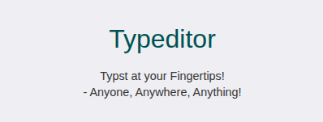

# Typeditor


Typeditor is a web-based document editor that allows users to write
documents using the Typst markup language directly in the browser and
convert them into PDF format. 

# Install

To resolve dependencies, run:

```shell
bun install
```
or

```shell
npm install
```


To start dev server, run:
```shell
bun run dev
```
or
```shell
npm run dev
```

